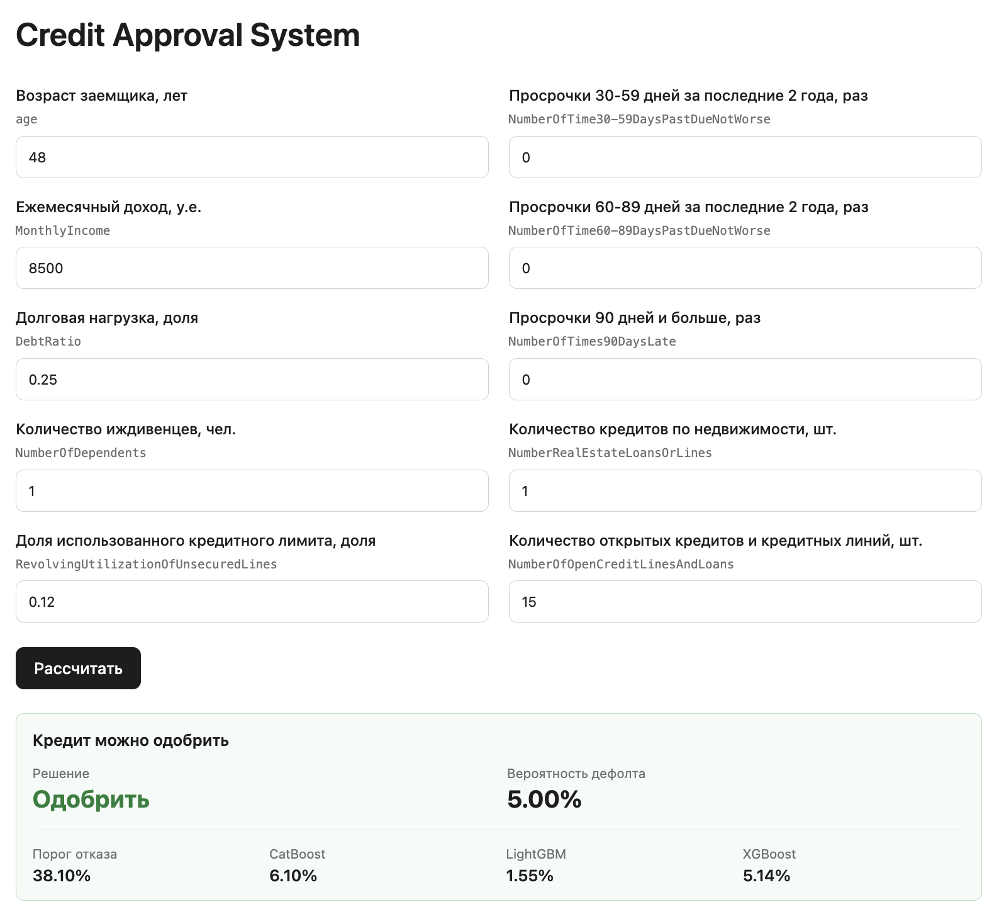
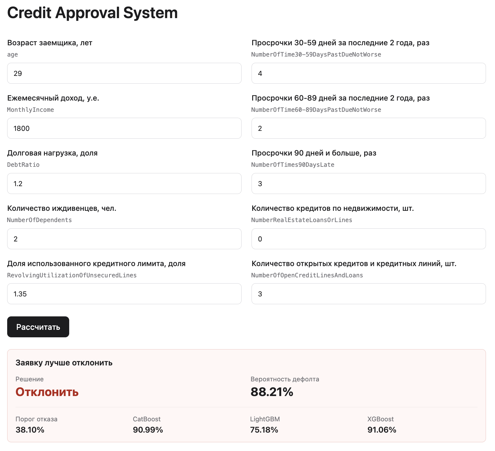

# Credit Approval ML system

## About

ML service for credit risk scoring based on borrower data. The API returns default probability and credit approval decision using a weighted blend ensemble.

### Examples

### Dataset

[Dataset description](/data/data_description.md)  
[Source dataset](https://www.kaggle.com/competitions/GiveMeSomeCredit/data)

Preprocessing:

- stratified split
- drop `Unnamed: 0`
- fill missing values with train medians
- missing flags and feature engineering

Output:

- `/data/processed/train.csv`
- `/data/processed/valid.csv`
- `/data/processed/test.csv`
- `/data/processed/prepare_data_metadata.json` - preparation parameters

### Models

The final ensemble uses the following models:

- `CatBoostClassifier`
- `LGBMClassifier`
- `XGBClassifier`

Hyperparameter optimization was performed separately for each model using `Optuna`. Model performance was evaluated using stratified cross-validation with `StratifiedKFold` with 3 folds.

Final result:

- OOF predictions for each model
- weighted blend with weights optimized by `Optuna`
- `/predict` API endpoint for inference

Weighted blend metrics:

- OOF PR-AUC: `0.4058`
- Test PR-AUC: `0.4095`

### Business decision

The rejection threshold is tuned separately on OOF predictions using a simple profit function:

- good approved client: `+1`
- default approved client: `-5`

Final threshold: `0.381`.

On test:

- profit: `16234`
- approval rate: `0.8975`
- bad recall rejected: `0.5612`

## Technology stack

Backend:

- FastAPI

Frontend:

- HTML5
- CSS3
- JavaScript ES6

ML:

- NumPy
- Pandas
- Matplotlib
- Seaborn
- Scikit-learn
- Optuna
- CatBoost
- LightGBM
- XGBoost

## Project structure

- `/backend` - backend API
- `/frontend` - frontend application
- `/data` - original and preprocessed datasets
- `/ml` - ML layer
- `/artifacts` - local model and ensemble artifacts
- `README.md` - project description
- `README_en.md` - project description in english
